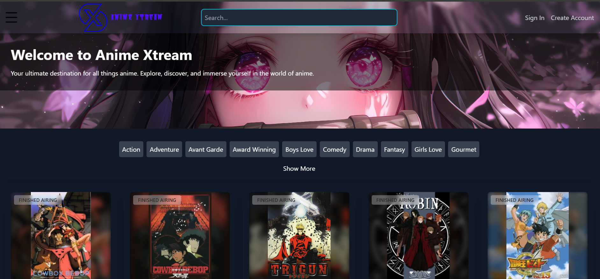

# animexstream - Web App Anime Streaming

Welcome to **animexstream**, a modern web app for streaming anime, built using **React**, **Vite**, **TailwindCSS**, and more. This app provides a sleek, fast, and responsive user interface to enjoy your favorite anime.

## Features

- 🎥 **Stream anime content** seamlessly.
- 🌀 **Interactive anime sliders** using **React Slick**.
- 🎨 **Customizable styles** with **TailwindCSS**.
- ⚡ **Lightweight, fast loading** experience thanks to **Vite**.

---

## 🚀 Quick Start

To get started with **animexstream**, follow these steps:

### 1. Clone the repository

Clone the repository to your local machine:

```bash
git clone https://github.com/your-username/animexstream.git
cd animexstream

```
2. Install Dependencies
Make sure you have Node.js (>= 18.3.1) installed. Then, install the required dependencies:

```bash
npm install
npm run dev
```
Your app will be available at http://localhost:5173 by default.


#📦 Available Scripts
```bash
npm run dev
This command runs both Vite and TailwindCSS watcher using concurrently. The app will update automatically with any changes you make to the source files.

npm run build
This command creates an optimized production build of the app in the /dist folder.

npm run lint
Run ESLint to ensure your code adheres to best practices and doesn't contain any syntax issues.

npm run preview
Preview the final production build locally after running npm run build.
```
---
#🧩 Dependencies

The application uses the following key dependencies:

React: For building the user interface.
React Router Dom: For handling routing within the app.
React Slick: For creating interactive anime sliders.
Axios: For fetching anime data through HTTP requests.
Lottie React: For integrating animations and creating a dynamic user experience.
TailwindCSS: For utility-first CSS styling.
Vite: A super-fast build tool that optimizes the development experience.
---

#📦 Development Dependencies
ESLint: For linting your code and maintaining code quality.
Vite Plugin for React: To enable fast refresh and optimize React development.
TailwindCSS: For a responsive, utility-first design.
Concurrently: For running multiple commands at once, like Vite and TailwindCSS simultaneously.
---

#🌟 Contributing
We welcome contributions! To contribute to the animexstream project:

Fork the repository.
Clone your fork to your local machine.
Create a new branch for your feature or bug fix.
Make your changes, ensuring code is linted.
Test your changes locally.
Commit your changes and push the branch to your fork.
Open a pull request to the main repository.
🧑‍💻 Authors
Creepjx (Project Maintainer)
📜 License
This project is licensed under the MIT License. Feel free to use, modify, and distribute the code.
---
🤖 Technologies Used
React 18.x
Vite 6.x
TailwindCSS 3.x
React Router Dom 7.x
Axios 1.7.x
React Slick 0.30.x
Concurrently
---
📝Notes
The application is in early development, so expect new features and improvements in future versions.
Feel free to suggest features, report bugs, or contribute via issues or pull requests.
🖼️ Screenshot
Here’s a preview of the animexstream interface:


 
🎉 Stay Updated
Follow the repository for the latest updates and features.
Join our discussions and share your thoughts or feature requests!
Happy Anime Streaming! 🍿📺
